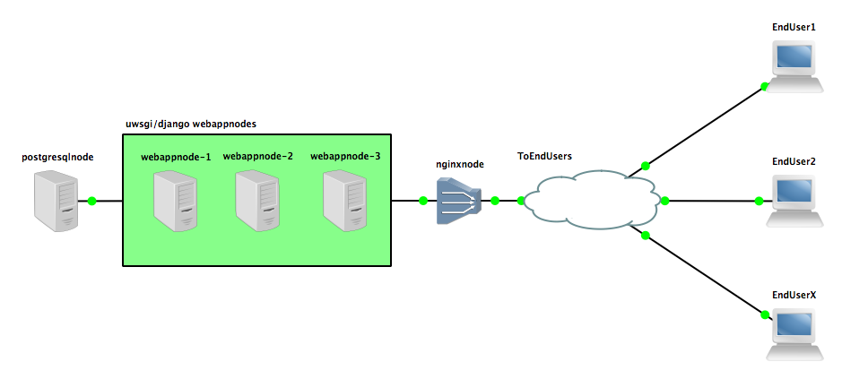

# Automated Vagrant Web Cluster Deploy
This is a work in progress production level deploy of [ghquery](https://github.com/shibusa/ghquery) in a nginx load balanced web app with PostgreSQL database.  With Vagrant, I'm able to spin up 5 Centos 7 virtual machines from scratch to being configured, ready to run in 20 minutes time.  The idea is to build on this over time so it can support other apps with even less configuration, have improved deploy times, and have greater levels of redundancy for higher availability.

This covers:
- Starting VMs
- Deploying base CentOS 7 image
- Installing required software dependent on host's role (nginx, postgresql, uwsgi/django)
- Configuring software and services
- Starting all services for the app to be up and running
- Redeploying with project updates

## Cluster Design


| Role | Software | Hostname | IP Address | Port | Description |
| --- | --- | --- | --- | --- | --- |
| http | nginx | nginxnode | 192.168.1.10 | 80 | the HTTP server/load balancer to respond to user requests, serve the front end, and balance traffic to each of the webapp/framework servers |
| webapp | django<br><br>uwsgi | webappnode-1<br>webappnode-2<br>webappnode-3 | 192.168.1.21<br>192.168.1.22<br>192.168.1.23 | 8000 | the webapp/framework which conducts the logic dependent on the user's HTTP requests<br><br>the server which uses wsgi to connect the webapp to the HTTP server |
| database | PostgreSQL | postgresqlnode | 192.168.1.30 | 5432 | the database to store all the data passed from the users |

## Other Notes
- Git is used to pull the full project repo originally for the nginxnode and webappnodes.  Git sparsecheckout was implemented to minimize request to only the necessary files, reducing data download size on each host.
- Base ghquery project does not include HTTPS as the django's built in http server is not meant for production use.  HTTPS is implemented on nginx with HTTP redirect to enforce HTTPS usage.
- fail_timeout implemented on nginx to ensure unresponsive webnodes to be excluded from rotation for new connections within a set time range.

## Virtual Machines
- 1 nginx load balancer
- 3 uwsgi servers with django
- 1 PostgreSQL database server

## Requirements
- [Vagrant](https://www.vagrantup.com/)
- [Virtualbox](https://www.virtualbox.org/)

## Setup
**__Currently only viable on 192.168.1.0/24 network with the IPs listed above unused__**
1. Download requirements.
2. Change directory to the same one housing 'Vagrantfile.'
3. Adjust Vagrantfile so the interface of each of the VMs are accessible as per this [doc](https://www.vagrantup.com/docs/networking/public_network.html).
4. (Optional) Generate a public key that can be used to SSH into the VMs.
5. Start the VMs up.
```
vagrant up
```
6. Visit 192.168.1.10 in web browser of choice to see a fully deployed [ghquery](https://github.com/shibusa/ghquery).
7. Login with
```
account: admin
password: password
```

### Accessing VMs
1. Use `vagrant status` to view node names and status
```
Documents/webcluster [master●] » vagrant status
Current machine states:

postgresqlnode            running (virtualbox)
webappnode-1              running (virtualbox)
webappnode-2              running (virtualbox)
webappnode-3              running (virtualbox)
nginxnode                 running (virtualbox)

This environment represents multiple VMs. The VMs are all listed
above with their current state. For more information about a specific
VM, run `vagrant status NAME`.
```
2. Use `vagrant ssh {nodename}` to log into the physical machine.
```
Documents/webcluster » vagrant ssh postgresqlnode
[vagrant@postgresql ~]$
```
  1. Alternatively you can do a standard ssh to the VM's public address with your public key.
  ```
  Documents/webcluster » ssh vagrant@192.168.1.30
  Last login: Wed Jul 26 03:28:58 2017 from 192.168.1.200
  [vagrant@postgresql ~]$
  ```
## Discovered Limitations
- [nginx high availability](https://www.nginx.com/products/feature-matrix/) is not available in the open source version.  This can potentially be bypassed with a separate, dedicated networking load balancer and multiple nginx hosts.  Alternatively mutliple nginx hosts behind a source NAT.
- Virtualbox isn't supported by [vagrant up --parallel](https://www.vagrantup.com/docs/virtualbox/usage.html).  This means provisioning happens sequentially.  Potential work around is using a separate wrapper to check node names via vagrant status, then starting nodes up in a multithreaded manner.  Other [providers](https://www.vagrantup.com/docs/providers/) are more capable, a non-wrapper method is possible with Vagrant being installed along with it.

## To Do List
- [ ] Secure the database and the connection between the uwsgi nodes and the database itself.
- [ ] Redundant database.
- [ ] Potentially implement a repo cache to minimize calls to the internet for software/dependencies/github clone.
- [ ] Figure out a way where static IP addressing is unnecessary.
- [ ] Determine if SELINUX is a must.  Potentially infrastructure dependent. I.E. Proper firewalls/ACLs/VLANs.
- [ ] Convert BASH scripts to Python for readability/coding simplicity
